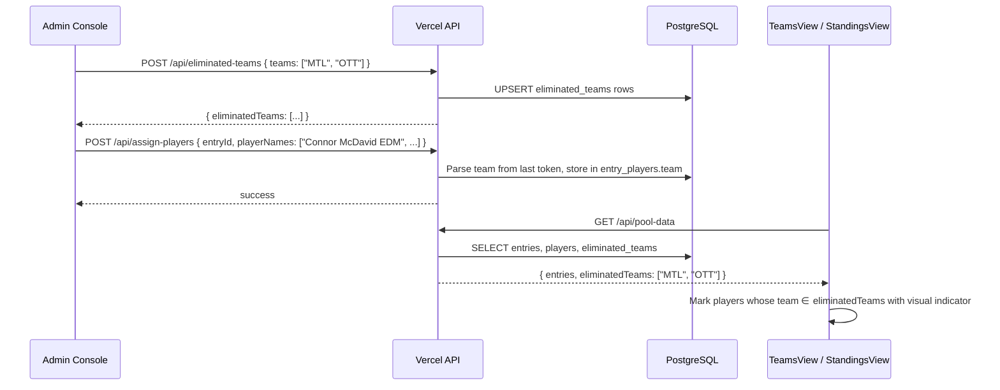

# Design Document: Eliminated Teams

## Overview

Add team elimination tracking to the NHL playoff pool. Players are associated with NHL teams, and when a team is eliminated from the playoffs, all players on that team are visually marked as eliminated in the UI. The admin can manage which teams are eliminated via the admin console. Player data entry is modified to include a team abbreviation alongside the player name.

## Main Algorithm/Workflow



## Core Interfaces/Types

```javascript
// --- Database: new table ---
// eliminated_teams
// | team_code VARCHAR(10) PRIMARY KEY | eliminated_at TIMESTAMPTZ DEFAULT NOW() |

// --- Database: altered table ---
// entry_players gains column:
// | team VARCHAR(10) DEFAULT NULL |

// --- API response shape from GET /api/pool-data ---
// poolData.eliminatedTeams: string[]   e.g. ["MTL", "OTT", "BUF"]

// --- Pinia store: new eliminatedTeams store ---
const eliminatedTeamsState = {
  eliminatedTeams: []  // string[] of team codes
}

// --- Player name format (input convention) ---
// "Connor McDavid EDM"
// Parsed as: { playerName: "Connor McDavid", team: "EDM" }
// Last space-separated token is team code if it matches /^[A-Z]{2,4}$/
// Otherwise the entire string is the player name with no team
```

## Key Functions with Formal Specifications

### Function 1: parsePlayerNameAndTeam(raw)

```javascript
/**
 * @param {string} raw - e.g. "Connor McDavid EDM"
 * @returns {{ playerName: string, team: string | null }}
 */
function parsePlayerNameAndTeam(raw) {
  const trimmed = raw.trim()
  const parts = trimmed.split(/\s+/)
  if (parts.length >= 2) {
    const lastToken = parts[parts.length - 1]
    if (/^[A-Z]{2,4}$/.test(lastToken)) {
      return { playerName: parts.slice(0, -1).join(' '), team: lastToken }
    }
  }
  return { playerName: trimmed, team: null }
}
```

**Preconditions:**
- `raw` is a non-empty string

**Postconditions:**
- `playerName` is always a non-empty trimmed string
- `team` is either a 2-4 uppercase letter string or `null`
- If the last space-separated token is 2-4 uppercase letters, it is treated as the team code
- If no valid team code suffix exists, `playerName` equals the trimmed input and `team` is `null`
- Original player name matching for scoring is unaffected (team suffix is stripped before storage in `player_name`)

**Loop Invariants:** N/A

### Function 2: isPlayerEliminated(playerTeam, eliminatedTeams)

```javascript
/**
 * @param {string | null} playerTeam - team code for the player, e.g. "EDM"
 * @param {string[]} eliminatedTeams - list of eliminated team codes
 * @returns {boolean}
 */
function isPlayerEliminated(playerTeam, eliminatedTeams) {
  if (!playerTeam) return false
  return eliminatedTeams.includes(playerTeam.toUpperCase())
}
```

**Preconditions:**
- `eliminatedTeams` is an array of uppercase team code strings (may be empty)
- `playerTeam` is a string or null

**Postconditions:**
- Returns `true` if and only if `playerTeam` is non-null and exists in `eliminatedTeams` (case-insensitive)
- Returns `false` when `playerTeam` is null (player without team data is never eliminated)

**Loop Invariants:** N/A

### Function 3: API handler — POST /api/eliminated-teams

```javascript
/**
 * POST body: { teams: string[] }
 * Replaces the full set of eliminated teams.
 * 
 * GET: returns current eliminated teams list.
 */
export default async function handler(req, res) {
  if (req.method === 'GET') {
    const { rows } = await sql`SELECT team_code FROM eliminated_teams ORDER BY eliminated_at ASC`
    return res.json(rows.map(r => r.team_code))
  }

  if (req.method === 'POST') {
    const { teams } = req.body
    if (!Array.isArray(teams)) {
      return res.status(400).json({ error: 'teams array required' })
    }
    // Validate: each team is a non-empty string of 2-4 uppercase letters
    const valid = teams.every(t => typeof t === 'string' && /^[A-Z]{2,4}$/.test(t))
    if (!valid) {
      return res.status(400).json({ error: 'Each team must be 2-4 uppercase letters' })
    }

    await sql`DELETE FROM eliminated_teams`
    for (const team of teams) {
      await sql`INSERT INTO eliminated_teams (team_code) VALUES (${team}) ON CONFLICT DO NOTHING`
    }

    return res.json({ eliminatedTeams: teams })
  }

  return res.status(405).json({ error: 'Method not allowed' })
}
```

**Preconditions:**
- POST body `teams` is an array of strings matching `/^[A-Z]{2,4}$/`
- Database connection is available

**Postconditions:**
- After POST: `eliminated_teams` table contains exactly the teams from the request (full replace)
- GET returns all team codes currently in the `eliminated_teams` table
- Duplicate team codes in the input are silently deduplicated via `ON CONFLICT DO NOTHING`

**Loop Invariants:**
- During the insert loop: all previously inserted teams are valid and persisted

### Function 4: Modified assign-players handler (team extraction)

```javascript
// In api/assign-players.js — modified player insertion loop
for (let i = 0; i < playerNames.length; i++) {
  const raw = playerNames[i].trim()
  const { playerName, team } = parsePlayerNameAndTeam(raw)
  await sql`
    INSERT INTO entry_players (entry_id, player_name, position, team)
    VALUES (${entryId}, ${playerName}, ${i + 1}, ${team})
  `
}
```

**Preconditions:**
- `playerNames` is an array of 15 strings
- Each string may or may not end with a team code suffix (e.g. "Connor McDavid EDM")

**Postconditions:**
- `player_name` column stores the clean name without team suffix (preserves scoring match)
- `team` column stores the extracted team code or NULL
- Position ordering is preserved

**Loop Invariants:**
- For each iteration `i`: players at positions 1..i are inserted with correct name and team

### Function 5: Pinia store — useEliminatedTeamsStore

```javascript
import { defineStore } from 'pinia'
import { ref, computed } from 'vue'

export const useEliminatedTeamsStore = defineStore('eliminatedTeams', () => {
  const eliminatedTeams = ref([])   // string[]

  const hydrateFromData = (teamsArray) => {
    eliminatedTeams.value = teamsArray || []
  }

  const isTeamEliminated = (teamCode) => {
    if (!teamCode) return false
    return eliminatedTeams.value.includes(teamCode.toUpperCase())
  }

  return {
    eliminatedTeams,
    hydrateFromData,
    isTeamEliminated
  }
})
```

**Preconditions:**
- `hydrateFromData` receives an array of uppercase team code strings (or null/undefined)

**Postconditions:**
- `eliminatedTeams` ref always contains an array (never null)
- `isTeamEliminated` returns boolean; false for null/undefined input

### Function 6: Modified pool-data API (include eliminated teams + player teams)

```javascript
// In api/pool-data.js — add to the parallel query array:
sql`SELECT team_code AS "teamCode" FROM eliminated_teams ORDER BY eliminated_at ASC`

// In the entry_players query, add team column:
sql`SELECT entry_id AS "entryId", player_name AS "playerName", position, team
    FROM entry_players ORDER BY position ASC`

// In the response, add:
// eliminatedTeams: eliminatedTeamsResult.rows.map(r => r.teamCode)
// And attach playerTeams map to each entry's players
```

**Preconditions:**
- Database tables `eliminated_teams` and `entry_players` (with `team` column) exist

**Postconditions:**
- Response includes `eliminatedTeams` array of team code strings
- Each entry's player data includes team information for UI rendering
- Backward compatible: entries without team data have `null` team values

## Algorithmic Pseudocode

### Player Assignment with Team Parsing

```javascript
// ALGORITHM: assignPlayersWithTeams(entryId, playerNames)
// INPUT: entryId (string), playerNames (string[15])
// OUTPUT: { entryId, playerNames, teams, submittedAt }

async function assignPlayersWithTeams(entryId, playerNames) {
  // ASSERT: playerNames.length === 15
  // ASSERT: entry exists in database

  await sql`DELETE FROM entry_players WHERE entry_id = ${entryId}`

  const parsedPlayers = []
  for (let i = 0; i < playerNames.length; i++) {
    const { playerName, team } = parsePlayerNameAndTeam(playerNames[i])
    // INVARIANT: parsedPlayers[0..i-1] all have valid playerName (non-empty)
    
    await sql`
      INSERT INTO entry_players (entry_id, player_name, position, team)
      VALUES (${entryId}, ${playerName}, ${i + 1}, ${team})
    `
    parsedPlayers.push({ playerName, team })
  }

  await sql`UPDATE entries SET submitted_at = NOW() WHERE id = ${entryId}`

  // POSTCONDITION: entry_players has exactly 15 rows for this entryId
  // POSTCONDITION: each row has player_name (clean) and team (nullable)
  return { entryId, players: parsedPlayers, submittedAt: new Date().toISOString() }
}
```

### UI Rendering with Elimination Status

```javascript
// ALGORITHM: renderPlayerRow(playerName, playerTeam, eliminatedTeams, points)
// INPUT: playerName (string), playerTeam (string|null), eliminatedTeams (string[]), points (number)
// OUTPUT: rendered player row with elimination visual indicator

function getPlayerDisplayState(playerName, playerTeam, eliminatedTeams) {
  const eliminated = playerTeam !== null 
    && eliminatedTeams.includes(playerTeam.toUpperCase())

  return {
    playerName,
    team: playerTeam,
    eliminated,
    cssClass: eliminated ? 'player-eliminated' : '',
    // Eliminated players show with strikethrough + muted color + team badge
  }
}

// POSTCONDITION: eliminated === true ⟺ (playerTeam != null ∧ playerTeam ∈ eliminatedTeams)
// POSTCONDITION: cssClass is 'player-eliminated' when eliminated, '' otherwise
```

### Admin Eliminated Teams Management

```javascript
// ALGORITHM: updateEliminatedTeams(teamCodes)
// INPUT: teamCodes (string[]) — full replacement set
// OUTPUT: updated eliminatedTeams list

async function updateEliminatedTeams(teamCodes) {
  // PRECONDITION: each code matches /^[A-Z]{2,4}$/
  
  const response = await apiService.updateEliminatedTeams(teamCodes)
  // response.eliminatedTeams is the canonical list from the server
  
  eliminatedTeamsStore.hydrateFromData(response.eliminatedTeams)
  
  // POSTCONDITION: store.eliminatedTeams === response.eliminatedTeams
  // POSTCONDITION: UI reactively updates all player rows
  return response.eliminatedTeams
}
```

## Example Usage

```javascript
// --- Parsing player names with teams ---
parsePlayerNameAndTeam("Connor McDavid EDM")
// → { playerName: "Connor McDavid", team: "EDM" }

parsePlayerNameAndTeam("Sidney Crosby")
// → { playerName: "Sidney Crosby", team: null }

parsePlayerNameAndTeam("Auston Matthews TOR")
// → { playerName: "Auston Matthews", team: "TOR" }

// --- Checking elimination status ---
const eliminatedTeams = ["MTL", "OTT", "BUF"]

isPlayerEliminated("MTL", eliminatedTeams)  // → true
isPlayerEliminated("EDM", eliminatedTeams)  // → false
isPlayerEliminated(null, eliminatedTeams)   // → false

// --- Admin: marking teams as eliminated ---
await apiService.updateEliminatedTeams(["MTL", "OTT", "BUF"])
// Server replaces eliminated_teams table, returns { eliminatedTeams: ["MTL", "OTT", "BUF"] }

// --- In TeamsView.vue template ---
// <span class="player-name" :class="{ 'player-eliminated': isEliminated(player) }">
//   {{ player.name }}
//   <span v-if="player.team" class="team-badge" :class="{ eliminated: isEliminated(player) }">
//     {{ player.team }}
//   </span>
// </span>

// --- In AdminView.vue: eliminated teams input ---
// Textarea with team codes (one per line or comma-separated)
// e.g. "MTL, OTT, BUF"
// Submit button calls apiService.updateEliminatedTeams(parsedCodes)

// --- pool-data response now includes ---
// {
//   participants: [...],
//   entries: [{ ..., playerNames: [...], playerTeams: { "connor mcdavid": "EDM", ... } }],
//   scoringEvents: [...],
//   eliminatedTeams: ["MTL", "OTT", "BUF"]
// }

// --- CSS for eliminated players ---
// .player-eliminated {
//   text-decoration: line-through;
//   opacity: 0.5;
//   color: var(--text-secondary);
// }
// .team-badge { font-size: 0.7rem; padding: 1px 4px; border-radius: 2px; }
// .team-badge.eliminated { background: var(--error-color); color: #fff; }
```

## Correctness Properties

*A property is a characteristic or behavior that should hold true across all valid executions of a system — essentially, a formal statement about what the system should do. Properties serve as the bridge between human-readable specifications and machine-verifiable correctness guarantees.*

### Property 1: Parser team extraction round-trip

*For any* non-empty player name string and *for any* valid team code (2-4 uppercase letters), concatenating them with a space and parsing the result SHALL produce the original player name and the original team code.

**Validates: Requirements 1.1, 2.3**

### Property 2: Parser no-team preservation

*For any* non-empty string that does not end with a space-separated token of 2-4 uppercase letters, parsing it SHALL return the full trimmed string as the player name and null as the team.

**Validates: Requirement 1.2**

### Property 3: Parser whitespace invariance

*For any* raw player string, parsing it SHALL produce the same result as parsing the trimmed version of that string.

**Validates: Requirement 1.4**

### Property 4: Parser non-empty name invariant

*For any* non-empty input string, the Parser SHALL always produce a non-empty player name.

**Validates: Requirement 1.5**

### Property 5: Eliminated teams full replacement

*For any* two valid lists of team codes, posting the first list then posting the second list and reading back SHALL return exactly the second list as a set (the first list is fully replaced).

**Validates: Requirements 3.1, 3.2, 3.5**

### Property 6: Invalid team code rejection

*For any* list containing at least one string that does not match the pattern of 2-4 uppercase letters, posting it to the Eliminated_Teams_API SHALL result in a 400 error.

**Validates: Requirement 3.3**

### Property 7: Duplicate team code deduplication

*For any* list of valid team codes that contains duplicates, posting it and reading back SHALL return a list with no duplicates.

**Validates: Requirement 3.4**

### Property 8: Elimination status correctness

*For any* player team code (or null) and *for any* list of eliminated team codes, `isPlayerEliminated` SHALL return true if and only if the team code is non-null and is contained in the eliminated teams list.

**Validates: Requirements 6.1, 6.2, 6.3, 6.4, 7.2, 7.3**

### Property 9: Points unaffected by elimination

*For any* set of entries with player scores and *for any* set of eliminated teams, the calculated total score for each entry SHALL be identical regardless of which teams are eliminated.

**Validates: Requirement 6.5**

### Property 10: Store hydration correctness

*For any* array of valid team code strings, hydrating the Eliminated_Teams_Store with that array and then reading the store state SHALL return the same array.

**Validates: Requirement 7.1**
