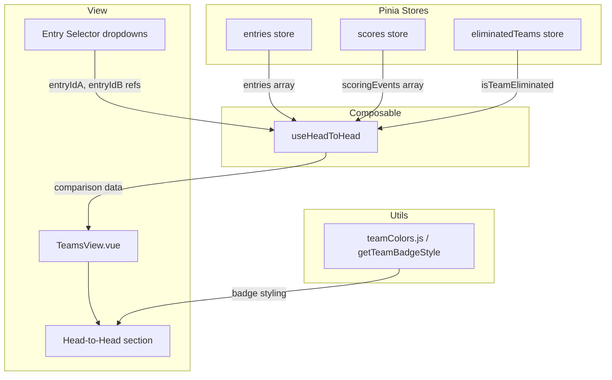

# Design Document: Head-to-Head

## Overview

The Head-to-Head feature adds a comparison section to the existing `StandingsView.vue` component that lets users pick two pool entries and see a detailed side-by-side breakdown. The section surfaces shared players, unique players per entry, score summaries, and a points breakdown split by active versus eliminated players.

### Key Design Decisions

1. **No new stores, API endpoints, or views.** All data is already available from the existing Pinia stores (`entries`, `scores`, `eliminatedTeams`) and the `teamColors` utility. The feature is a computed view over existing state, rendered as a new section within `TeamsView.vue`.

2. **Pure computation extracted into a composable.** Following the pattern established by `usePlayerPopularity`, all comparison logic lives in a new `useHeadToHead` composable. This keeps `StandingsView.vue` manageable and makes the logic independently testable without mounting a Vue component.

3. **Composable accepts two reactive entry IDs.** The composable takes two `ref` entry IDs as parameters (bound to the dropdown `v-model` values) and returns all computed comparison data. This keeps the composable pure and decoupled from the template's selection mechanism.

4. **Placement in TeamsView before the Player Overlap section.** The section slots in before the overlap matrix/list, matching the user's requirement and the existing visual flow of the Teams tab.

5. **Reuse existing visual patterns.** Team badges use `getTeamBadgeStyle`, eliminated players use the existing `player-eliminated` CSS class (strikethrough + reduced opacity), and tables follow the same styling conventions as the Player Popularity and Latest Player Stats tables.

## Architecture



The composable reads reactively from the three stores plus two entry-ID refs, and exposes computed values consumed by the template:

- `entryA` / `entryB` — the resolved entry objects (or `null`)
- `scoreA` / `scoreB` — total computed scores for each entry
- `sharedPlayers` — array of players appearing in both entries, sorted by points descending
- `uniquePlayersA` / `uniquePlayersB` — arrays of players unique to each entry, sorted by points descending
- `uniqueSubtotalA` / `uniqueSubtotalB` — sum of points from unique players per entry
- `breakdownA` / `breakdownB` — objects with `{ activePoints, eliminatedPoints, activeCount, eliminatedCount }`
- `isSameEntry` — boolean, true when both selectors point to the same entry
- `isReady` — boolean, true when two distinct entries are selected

## Components and Interfaces

### `useHeadToHead` Composable

**File:** `src/composables/useHeadToHead.js`

```javascript
/**
 * @param {import('vue').Ref<string|null>} entryIdA — reactive ID of the first selected entry
 * @param {import('vue').Ref<string|null>} entryIdB — reactive ID of the second selected entry
 *
 * @returns {{
 *   entryA: import('vue').ComputedRef<object|null>,
 *   entryB: import('vue').ComputedRef<object|null>,
 *   scoreA: import('vue').ComputedRef<number>,
 *   scoreB: import('vue').ComputedRef<number>,
 *   sharedPlayers: import('vue').ComputedRef<ComparisonPlayer[]>,
 *   uniquePlayersA: import('vue').ComputedRef<ComparisonPlayer[]>,
 *   uniquePlayersB: import('vue').ComputedRef<ComparisonPlayer[]>,
 *   uniqueSubtotalA: import('vue').ComputedRef<number>,
 *   uniqueSubtotalB: import('vue').ComputedRef<number>,
 *   breakdownA: import('vue').ComputedRef<PointsBreakdown>,
 *   breakdownB: import('vue').ComputedRef<PointsBreakdown>,
 *   isSameEntry: import('vue').ComputedRef<boolean>,
 *   isReady: import('vue').ComputedRef<boolean>
 * }}
 *
 * @typedef {Object} ComparisonPlayer
 * @property {string} playerName   — display name (original casing)
 * @property {string|null} team    — NHL team code, or null if unknown
 * @property {number} points       — current playoff points (0 if no scoring event)
 * @property {boolean} eliminated  — true when the player's team is eliminated
 *
 * @typedef {Object} PointsBreakdown
 * @property {number} activePoints      — sum of points from non-eliminated players
 * @property {number} eliminatedPoints  — sum of points from eliminated players
 * @property {number} activeCount       — count of non-eliminated players
 * @property {number} eliminatedCount   — count of eliminated players
 */
```

**Core algorithm:**

1. Look up `entryA` and `entryB` from the entries store by ID.
2. Build a points map from `scoringEvents` (lowercase player name → points).
3. Build sets of lowercase player names for each entry.
4. Compute shared players as the intersection of the two sets.
5. Compute unique players as the set difference for each entry.
6. For each player, resolve team from the entry's `playerTeams` map (for shared players, use the first non-null team code from either entry).
7. Determine elimination status via `eliminatedTeamsStore.isTeamEliminated(teamCode)`.
8. Compute total scores by summing points for all players in each entry.
9. Compute points breakdowns by partitioning each entry's players into active vs eliminated.
10. Sort shared and unique player arrays by points descending.

### TeamsView.vue Changes

The existing component gains:

- An import of `useHeadToHead`.
- Two `ref('')` values for the dropdown selections (`selectedEntryIdA`, `selectedEntryIdB`).
- Destructuring of all composable return values in `setup()`.
- A new `<section>` block in the template placed before the Player Overlap section.

No existing template blocks or computed properties are modified.

### Template Structure (Head-to-Head Section)

```html
<section class="head-to-head-section">
  <h3>Head-to-Head</h3>

  <!-- Entry selectors -->
  <div class="h2h-selectors">
    <select v-model="selectedEntryIdA">
      <option value="" disabled>Select entry…</option>
      <option v-for="e in entries" :key="e.id" :value="e.id">
        {{ e.participantName }}
      </option>
    </select>
    <span class="h2h-vs">vs</span>
    <select v-model="selectedEntryIdB">
      <option value="" disabled>Select entry…</option>
      <option v-for="e in entries" :key="e.id" :value="e.id">
        {{ e.participantName }}
      </option>
    </select>
  </div>

  <!-- Validation messages -->
  <p v-if="entries.length < 2" class="h2h-message">
    At least two entries are required for comparison
  </p>
  <p v-else-if="isSameEntry" class="h2h-message">
    Please select two different entries to compare
  </p>

  <!-- Comparison panel -->
  <div v-else-if="isReady" class="h2h-comparison">
    <!-- Score summary -->
    <!-- Shared players table -->
    <!-- Unique players columns -->
    <!-- Points breakdown -->
  </div>
</section>
```

### Score Summary Sub-section

Displays participant names as column headers with total scores. The higher score gets a `h2h-winner` CSS class that applies a highlight. When scores are tied, neither gets the class.

### Shared Players Sub-section

A table listing every player found in both entries. Columns: Player, Team (badge), Points. Sorted by points descending. Empty state: "No shared players".

### Unique Players Sub-section

Two side-by-side columns (stacked on mobile), each listing the players unique to that entry. Each column has a subtotal row. Sorted by points descending within each column.

### Points Breakdown Sub-section

For each entry, shows:
- Active players count and total active points
- Eliminated players count and total eliminated points

Uses green/muted styling consistent with the app's existing eliminated player treatment.

### Responsive Behavior

On viewports ≤ 768px:
- The entry selectors stack vertically.
- Unique players columns stack vertically instead of side-by-side.
- Table cells use reduced padding consistent with existing mobile patterns.
- All styling uses the app's existing CSS custom properties.

## Data Models

No new persistent data models are introduced. The feature operates entirely on in-memory computed state derived from existing store data.

### Existing Store Shapes (consumed, not modified)

**Entry** (from `entries` store):
```javascript
{
  id: string,
  email: string,
  participantName: string,
  playerNames: string[],        // e.g. ["Connor McDavid", "Cale Makar", ...]
  playerTeams: {                 // lowercase name → team code
    "connor mcdavid": "EDM",
    "cale makar": "COL"
  },
  totalScore: number,
  createdAt: string              // ISO 8601
}
```

**Scoring Event** (from `scores` store):
```javascript
{
  id: string,
  playerName: string,            // e.g. "Connor McDavid"
  points: number,
  createdAt: string
}
```

**Eliminated Teams** (from `eliminatedTeams` store):
```javascript
string[]  // e.g. ["EDM", "MTL"]
```

### Derived Shapes (output of composable)

**ComparisonPlayer:**
```javascript
{
  playerName: string,    // original casing
  team: string | null,   // NHL team code
  points: number,        // from scores store, default 0
  eliminated: boolean    // true if team is eliminated
}
```

**PointsBreakdown:**
```javascript
{
  activePoints: number,      // sum of points from active players
  eliminatedPoints: number,  // sum of points from eliminated players
  activeCount: number,       // count of active players
  eliminatedCount: number    // count of eliminated players
}
```


## Correctness Properties

*A property is a characteristic or behavior that should hold true across all valid executions of a system — essentially, a formal statement about what the system should do. Properties serve as the bridge between human-readable specifications and machine-verifiable correctness guarantees.*

### Property 1: Score computation equals sum of player points

*For any* two entries with any combination of player names and any set of scoring events, the computed score for each entry SHALL equal the sum of points looked up (case-insensitively) from the scoring events for every player in that entry's `playerNames` array, defaulting to 0 when no matching scoring event exists.

**Validates: Requirements 3.2, 10.3**

### Property 2: Player partitioning into shared and unique is complete and disjoint

*For any* two entries with any combination of player names, the union of shared players, unique-to-A players, and unique-to-B players SHALL equal the union of all players across both entries (case-insensitive), with no player appearing in more than one category. Specifically: shared players are exactly the case-insensitive intersection of the two `playerNames` arrays, unique-to-A are those in A but not B, and unique-to-B are those in B but not A.

**Validates: Requirements 4.1, 5.2**

### Property 3: Elimination flag matches team elimination status

*For any* player in any output array (shared, unique-to-A, or unique-to-B) with a resolved team code and any set of eliminated teams, the `eliminated` flag SHALL be `true` if and only if the player's team code is present in the eliminated teams list. Players with a `null` team code SHALL always have `eliminated` set to `false`.

**Validates: Requirements 4.3, 5.4, 7.1, 7.3**

### Property 4: All player arrays are sorted by points descending

*For any* two entries and any set of scoring events, the `sharedPlayers`, `uniquePlayersA`, and `uniquePlayersB` arrays SHALL each be sorted in descending order by `points`.

**Validates: Requirements 4.5, 5.5**

### Property 5: Unique player subtotals equal sum of unique player points

*For any* two entries and any set of scoring events, `uniqueSubtotalA` SHALL equal the sum of `points` across all players in `uniquePlayersA`, and `uniqueSubtotalB` SHALL equal the sum of `points` across all players in `uniquePlayersB`.

**Validates: Requirements 5.6**

### Property 6: Points breakdown partitions entry players into active and eliminated

*For any* entry with any combination of players, team assignments, scoring events, and eliminated teams, the points breakdown SHALL satisfy: `activePoints + eliminatedPoints` equals the entry's total score, and `activeCount + eliminatedCount` equals the total number of players in the entry's `playerNames` array.

**Validates: Requirements 6.2, 6.3, 6.4**

### Property 7: Team resolution uses entry playerTeams with first-non-null for shared players

*For any* player appearing in the output, the resolved `team` SHALL equal the team code from the containing entry's `playerTeams` map (looked up by lowercase player name). For shared players appearing in both entries, the resolved `team` SHALL be the first non-null team code found when checking entry A's `playerTeams` then entry B's `playerTeams`.

**Validates: Requirements 8.1, 8.2**

## Error Handling

The feature operates on in-memory Pinia store data that is already validated at hydration time by the existing API layer. Error scenarios are limited to data-shape edge cases:

| Scenario | Handling |
|---|---|
| `entries` array is empty | Section shows "No entries are available" empty state; dropdowns are not rendered |
| Fewer than 2 entries exist | Section shows "At least two entries are required for comparison" message |
| Same entry selected in both dropdowns | `isSameEntry` is `true`; section shows "Please select two different entries to compare" |
| Only one dropdown has a selection | `isReady` is `false`; comparison panel is not rendered |
| Selected entry has empty or undefined `playerNames` | Composable treats it as `[]` — consistent with existing StandingsView pattern (`entry.playerNames \|\| []`) |
| `playerTeams` is missing or undefined on an entry | Team resolution skips that entry for the player — team remains `null` |
| Scoring event has no matching player | Player gets `points: 0` — no error |
| `eliminatedTeams` store is empty | All players show `eliminated: false` |
| A selected entry is removed from the store while selected | `entryA` or `entryB` resolves to `null`; `isReady` becomes `false`; comparison panel hides |

No new error boundaries, try/catch blocks, or user-facing error messages are needed beyond the validation messages listed above.

## Testing Strategy

### Dual Testing Approach

The feature is well-suited for property-based testing because the core logic is a pure computation (set operations, aggregation, partitioning, sorting) over in-memory data with clear input/output behavior and a large input space (arbitrary player names, entry compositions, scoring events, team assignments, eliminated teams).

**Property-based tests** verify the seven correctness properties above using `fast-check` (already installed as a project dependency). Each property test runs a minimum of 100 iterations with randomly generated entries, scoring events, and eliminated teams.

**Example-based unit tests** cover:
- Specific rendering checks (heading text, dropdown options, participant name headers)
- UI state transitions (same-entry warning, comparison panel visibility)
- Edge cases (empty entries, no players assigned, no scoring events, tied scores)
- DOM placement (head-to-head section appears between Player Popularity and MVP card)
- Visual highlight on the winning entry

### Test Organization

| Test File | Type | What It Covers |
|---|---|---|
| `src/composables/__tests__/useHeadToHead.test.js` | Unit + Property | Composable logic: score computation, player partitioning, elimination flags, sorting, subtotals, points breakdown, team resolution |
| `src/views/__tests__/TeamsView.test.js` | Unit (additions) | Section placement, heading, dropdowns, validation messages, empty states, winner highlight |

### Property-Based Testing Configuration

- **Library:** `fast-check` (v3.13.0, already installed)
- **Minimum iterations:** 100 per property
- **Tag format:** `Feature: head-to-head, Property {N}: {title}`

Each property test generates:
- Two random entries with random `playerNames` arrays (varying lengths, casings, overlaps)
- Random `playerTeams` maps with valid NHL team codes and occasional nulls
- Random scoring events with random player names and point values
- Random eliminated team lists

The generators ensure coverage of edge cases like empty player arrays, fully overlapping rosters, fully disjoint rosters, all players eliminated, no players eliminated, and mixed casing.

### What Is NOT Property-Tested

- **DOM structure and CSS styling** (Requirements 1.1, 1.2, 2.1, 2.2, 3.1, 3.3, 5.1, 6.1, 6.5, 7.2, 9.1, 9.2, 9.3) — rendering concerns tested via example-based tests or visual inspection
- **Validation messages** (Requirements 2.3, 2.5) — specific edge cases tested with example-based tests
- **Empty state messages** (Requirements 4.4, 10.1, 10.2) — specific edge cases tested with example-based tests
- **Score highlight logic** (Requirements 3.3, 3.4) — simple comparison tested with example-based tests
