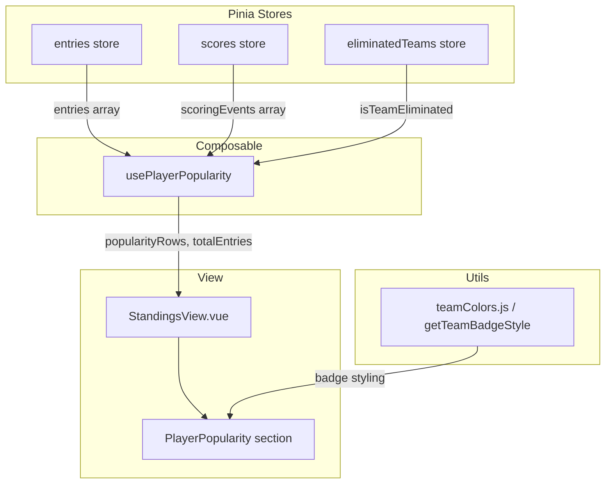

# Design Document: Player Popularity

## Overview

The Player Popularity feature adds a new section to the existing `StandingsView.vue` component that aggregates every unique player across all pool entries and ranks them by how many entries drafted them (pick count). This gives participants a quick view of "chalk" picks versus "sleepers," alongside each player's current points, team badge, and elimination status.

### Key Design Decisions

1. **No new stores or API endpoints.** All data is already available from the existing Pinia stores (`entries`, `scores`, `eliminatedTeams`) and the `teamColors` utility. The feature is purely a computed view over existing state.

2. **Pure computation extracted into a composable.** The aggregation, sorting, and team-resolution logic will live in a new composable (`usePlayerPopularity`) rather than inline in the template's `setup()`. This keeps `StandingsView.vue` manageable and makes the logic independently testable without mounting a Vue component.

3. **Placement within StandingsView.** The section is inserted between the standings table and the MVP Player card, matching the user's requirement and the existing visual flow.

4. **Reuse existing visual patterns.** Team badges use `getTeamBadgeStyle`, eliminated players use the same `player-eliminated` CSS class (strikethrough + reduced opacity), and the table follows the same styling conventions as the "Latest Player Stats" table already in StandingsView.

## Architecture



The composable reads reactively from the three stores and exposes two computed values consumed by the template:

- `popularityRows` — sorted array of player objects ready for rendering
- `totalEntries` — the total number of entries (for the "Picked by N/M entries" label)

## Components and Interfaces

### `usePlayerPopularity` Composable

**File:** `src/composables/usePlayerPopularity.js`

```javascript
/**
 * @returns {{
 *   popularityRows: import('vue').ComputedRef<PlayerPopularityRow[]>,
 *   totalEntries: import('vue').ComputedRef<number>
 * }}
 *
 * @typedef {Object} PlayerPopularityRow
 * @property {string} playerName   — display name (original casing from first occurrence)
 * @property {string|null} team    — NHL team code (e.g. "EDM"), or null if unknown
 * @property {number} points       — current playoff points from scores store (0 if none)
 * @property {number} pickCount    — number of entries that drafted this player
 * @property {boolean} eliminated  — true when the player's team is eliminated
 */
```

**Aggregation algorithm (inside the composable):**

1. Iterate over every entry's `playerNames` array.
2. For each player name, normalize to lowercase as the map key.
3. On first encounter, store the original-cased name and resolve the team code from `entry.playerTeams`.
4. Increment the pick count for every occurrence.
5. After iterating all entries, look up each player's points from the scores store's `scoringEvents` (case-insensitive).
6. Determine elimination status via `eliminatedTeamsStore.isTeamEliminated(teamCode)`.
7. Sort the resulting array: descending pick count → descending points → ascending alphabetical name.

### StandingsView.vue Changes

The existing component gains:

- An import of `usePlayerPopularity`.
- Destructuring of `{ popularityRows, totalEntries }` in `setup()`.
- A new `<section>` block in the template placed immediately after the standings `<table>` and before the MVP card `<div>`.

No existing template blocks or computed properties are modified.

### Template Structure (Popularity Section)

```html
<section v-if="popularityRows.length > 0" class="player-popularity-section">
  <h3>Player Popularity</h3>
  <p class="popularity-subtitle">Across {{ totalEntries }} entries</p>
  <table class="player-popularity-table">
    <thead>
      <tr>
        <th>Player</th>
        <th class="team-col-header">Team</th>
        <th>Points</th>
        <th>Picked</th>
      </tr>
    </thead>
    <tbody>
      <tr v-for="row in popularityRows" :key="row.playerName">
        <td>
          <span :class="{ 'player-eliminated': row.eliminated }">
            {{ row.playerName }}
          </span>
        </td>
        <td>
          <span v-if="row.team" class="team-badge"
                :style="getTeamBadgeStyle(row.team, row.eliminated)">
            {{ row.team }}
          </span>
        </td>
        <td class="points-cell">{{ row.points }}</td>
        <td class="picked-cell">Picked by {{ row.pickCount }}/{{ totalEntries }} entries</td>
      </tr>
    </tbody>
  </table>
</section>

<!-- Empty states -->
<section v-else-if="entries.length === 0" class="player-popularity-section">
  <h3>Player Popularity</h3>
  <div class="empty-state"><p>No entries yet</p></div>
</section>

<section v-else class="player-popularity-section">
  <h3>Player Popularity</h3>
  <div class="empty-state"><p>No players assigned yet</p></div>
</section>
```

### Responsive Behavior

On viewports ≤ 768px the "Picked" column text shortens to just "N/M" (hiding the "Picked by … entries" prefix) via a CSS media query, consistent with the existing `hide-mobile` pattern. All styling uses the app's existing CSS custom properties (`--bg-card`, `--text-heading`, `--border-color`, etc.).

## Data Models

No new persistent data models are introduced. The feature operates entirely on in-memory computed state derived from existing store data.

### Existing Store Shapes (consumed, not modified)

**Entry** (from `entries` store):
```javascript
{
  id: string,
  email: string,
  participantName: string,
  playerNames: string[],        // e.g. ["Connor McDavid", "Cale Makar", ...]
  playerTeams: {                 // lowercase name → team code
    "connor mcdavid": "EDM",
    "cale makar": "COL"
  },
  totalScore: number,
  createdAt: string              // ISO 8601
}
```

**Scoring Event** (from `scores` store):
```javascript
{
  id: string,
  playerName: string,            // e.g. "Connor McDavid"
  points: number,
  createdAt: string
}
```

**Eliminated Teams** (from `eliminatedTeams` store):
```javascript
string[]  // e.g. ["EDM", "MTL"]
```

### Derived Shape (output of composable)

**PlayerPopularityRow:**
```javascript
{
  playerName: string,    // original casing from first occurrence
  team: string | null,   // NHL team code
  points: number,        // from scores store, default 0
  pickCount: number,     // count of entries containing this player
  eliminated: boolean    // true if team is eliminated
}
```


## Correctness Properties

*A property is a characteristic or behavior that should hold true across all valid executions of a system — essentially, a formal statement about what the system should do. Properties serve as the bridge between human-readable specifications and machine-verifiable correctness guarantees.*

### Property 1: Aggregation produces exactly one row per unique player with first-occurrence casing

*For any* set of entries with any combination of player names (including varied casing of the same name), the composable output SHALL contain exactly one row per case-insensitively-unique player name, and the displayed `playerName` SHALL match the casing of the first occurrence encountered across entries.

**Validates: Requirements 2.1, 2.4**

### Property 2: Pick count equals the number of entries containing that player

*For any* set of entries and any player appearing in the output, the `pickCount` SHALL equal the number of entries whose `playerNames` array contains that player (compared case-insensitively).

**Validates: Requirements 2.2**

### Property 3: Sort order invariant — descending pick count, descending points, ascending name

*For any* set of entries and scoring events, for every pair of consecutive rows in the output, the following SHALL hold: the first row's `pickCount` is greater than the second's, OR they are equal and the first row's `points` is greater than or equal to the second's, OR both `pickCount` and `points` are equal and the first row's `playerName` is alphabetically less than or equal to the second's.

**Validates: Requirements 3.1, 3.2, 3.3**

### Property 4: Points lookup correctness with zero default

*For any* set of entries and scoring events, each output row's `points` SHALL equal the `points` value from the scoring event matching that player's name (case-insensitive), or 0 if no matching scoring event exists.

**Validates: Requirements 4.2**

### Property 5: Elimination flag matches team elimination status

*For any* set of entries with player-team assignments and any set of eliminated teams, each output row's `eliminated` flag SHALL be `true` if and only if the player's resolved team code is present in the eliminated teams list.

**Validates: Requirements 5.1**

### Property 6: Team resolution uses first non-null team code across entries

*For any* player appearing in multiple entries with varying `playerTeams` values (including nulls), the output row's `team` SHALL equal the first non-null team code encountered when iterating entries in array order.

**Validates: Requirements 8.1, 8.2**

## Error Handling

The feature operates on in-memory Pinia store data that is already validated at hydration time by the existing API layer. Error scenarios are limited to data-shape edge cases:

| Scenario | Handling |
|---|---|
| `entries` array is empty | Composable returns empty `popularityRows`; template shows "No entries yet" empty state |
| Entries exist but all `playerNames` arrays are empty or undefined | Composable returns empty `popularityRows`; template shows "No players assigned yet" empty state |
| `playerNames` is `undefined` or not an array on an entry | Composable treats it as an empty array (`entry.playerNames \|\| []`) — consistent with existing StandingsView pattern |
| `playerTeams` is missing or undefined on an entry | Team resolution skips that entry for the player — no crash, team remains `null` |
| Scoring event has no matching player | Player gets `points: 0` — no error |
| `eliminatedTeams` store is empty | All players show `eliminated: false` — normal non-eliminated display |

No new error boundaries, try/catch blocks, or user-facing error messages are needed beyond the two empty-state messages.

## Testing Strategy

### Dual Testing Approach

The feature is well-suited for property-based testing because the core logic is a pure computation (aggregation + sorting + lookup) over in-memory data with clear input/output behavior and a large input space (arbitrary player names, entry counts, scoring events, team assignments).

**Property-based tests** verify the six correctness properties above using `fast-check` (already a project dependency). Each property test runs a minimum of 100 iterations with randomly generated entries, scoring events, and eliminated teams.

**Example-based unit tests** cover:
- Specific rendering checks (heading text, subtitle format, "Picked by N/M entries" string)
- Edge cases (empty entries, entries with no players, players with no team data)
- DOM placement (popularity section appears between standings table and MVP card)

### Test Organization

| Test File | Type | What It Covers |
|---|---|---|
| `src/composables/__tests__/usePlayerPopularity.test.js` | Unit + Property | Composable logic: aggregation, sorting, points lookup, team resolution, elimination flags |
| `src/views/__tests__/StandingsView.test.js` | Unit (additions) | Section placement, heading, empty states, rendered output format |

### Property-Based Testing Configuration

- **Library:** `fast-check` (v3.13.0, already installed)
- **Minimum iterations:** 100 per property
- **Tag format:** `Feature: player-popularity, Property {N}: {title}`

Each property test generates:
- Random entries with random `playerNames` arrays (varying lengths, casings, overlaps)
- Random scoring events with random player names and point values
- Random eliminated team lists

The generators ensure coverage of edge cases like empty arrays, single-entry pools, all-same-player entries, and mixed casing.

### What Is NOT Property-Tested

- **DOM structure and CSS styling** (Requirements 1.1, 1.2, 4.1, 4.3, 4.4, 7.1, 7.2, 7.3) — these are rendering concerns tested via example-based tests or visual inspection
- **Empty state messages** (Requirements 6.1, 6.2) — specific edge cases tested with example-based tests
